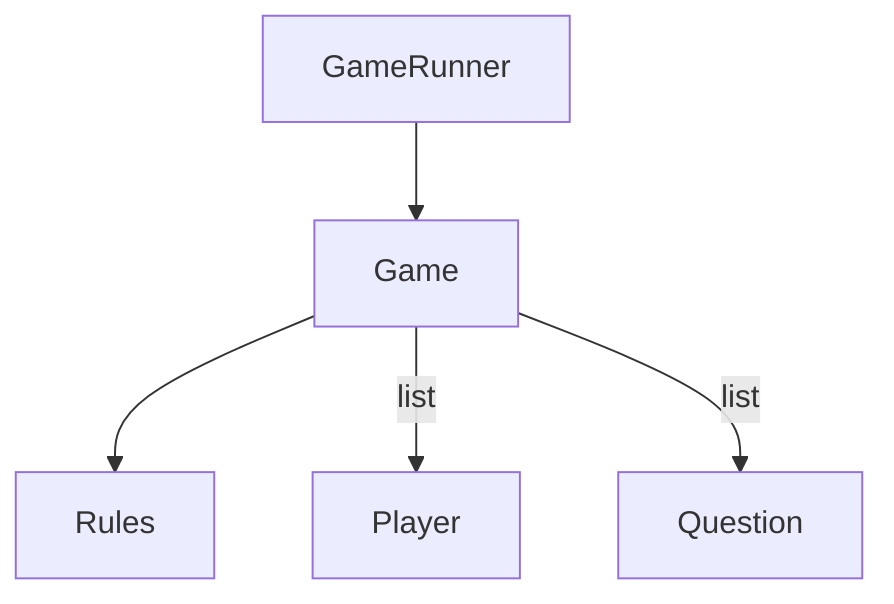

Trivia
======

Exécuter le GameRunner pour lancer la partie de Trivia.

Le jeu est composé de règles, d'une liste de joueurs et d'une liste de questions.

Rules
===
Dans la class Rules, on retrouve toutes les valeurs nécessaires au cadrage du jeu : le nombre de joueur (min & max), le nombre et la catégories des questions, la taille du plateau, ect... 

Remplacer une instance par une autre permet donc de facilement modifier le périmètre du jeu sans réécrire le reste du programme.

Player
===

Simple déclaration de ce qui constitue un joueur de Trivia : son nom, sa place sur le plateau de jeu, le nombre de pièces en sa possession et s'il est en prison ou non.

Question
===

Regroupe la définition d'une catégorie de question : le type ainsi que l'ensemble des question pour cette catégorie.

Game
===

Reste fondamentalement le même : il gère le déroulé du jeu. Néanmoins : 
- on a rendu aux classes concernées leur responsabilité (c'est le joueur qui sait comment le joueur s'appelle)
- on a refactoré le code pour qu'il soit plus lisible et maintenable

Tests
===

Dans le dossier Tests, on retrouve deux fichiers :
- expected.txt qui est la sortir originale du déroulé du jeu avant tout modification
- output.txt qui est la dernière sortie générée par l'exécution du programme
 
Le test existant compare ces deux fichiers pour s'assurer que le comportement du programme n'a pas changé après chaque modification.

